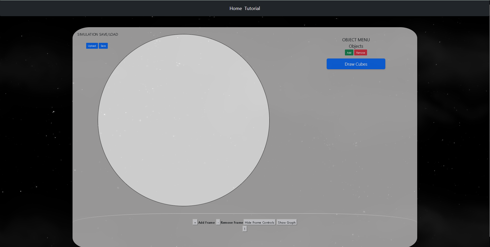

# Current Build Status


# Energy Frametasia

---


---
Energy Frametasia (EF) is designed to be accessible to all users with internet-enabled desktop or laptop computers. The
application will be hosted on a web server, allowing users to access it through a web browser. The target user base for
EF includes but is not limited to, physics instructors and students at the junior high to secondary education level.
With internet access, users can utilize the application from any location, including home, school, and office. EF offers
not only a demonstration tool but also a platform for homework assignments. Users can download, save, and upload their
work within the application.

### Deployment

Energy Frametasia can be deployed using GitHub pages, other hosting sites, or locally. All you have to do for deployment
is select ````index.html```` as the source.

### Development Environment

Steps to Set up:
1. Clone the repo
2. Run build.sh in terminal - `````./build.sh````` or ````sh build.sh````  
    This will install libraries and frameworks being used


### Application Features

what the application can do
