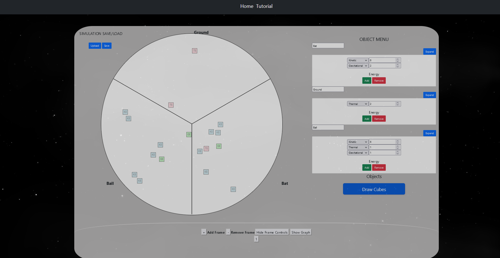
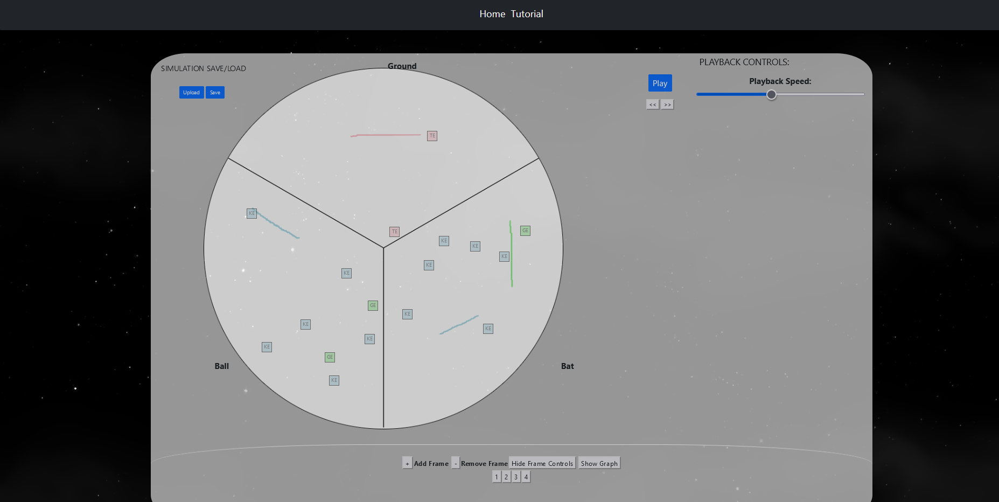
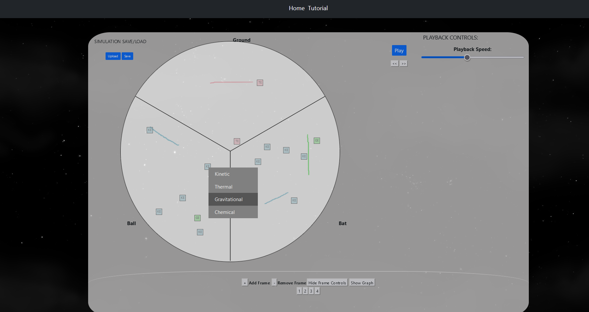
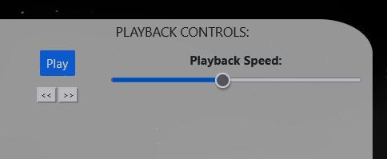
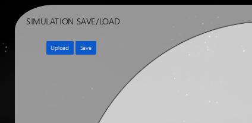
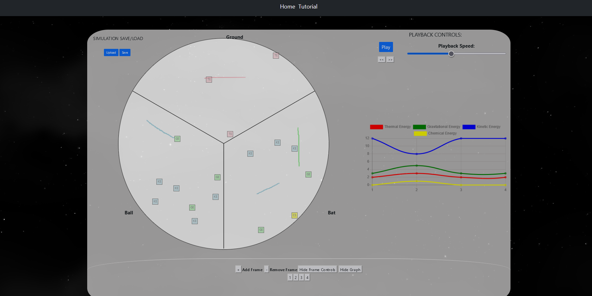

# Energy Frametasia

## Team Members

- Abel Almeida
- Raymundo Escobedo
- Stockton Woodworth

## Project Abstract

Science students struggle to understand and model energy effectively, and to relate those models to
the graphs, laws and equations that characterize most physics instruction. This project seeks to
develop an application in which students can develop, run, share, critique and modify dynamic models
of energy transfers and transformations in a range of scenarios. It builds on existing work by creating
an app where students construct frame-by-frame animations of energy transfers and transformations.
Programs that allow students to model and visualize energy physics do exist, but they do not allow
constructing custom animations of energy transfer or a way for students to test their knowledge.

This repository contains a web application that allows students to design custom energy transfer
scenarios by adding objects and energy to a system in the form of color-coded "energy cubes",
then creating a frame by frame representation of energy transfer in a given scenario. This will
allow students to test their knowledge of how energy is converted and transferred, and
to visualize the law of conservation of energy.

## Project Description

### What We Built

A tool for learning physics presents a visual demonstration of energy exchange between two objects. Users can transfer
any number of "energy cubes" between objects and switch between different types of energy. The tool is designed with the
fundamental principle that energy cannot be created or destroyed, so users cannot alter the total number of energy cubes
in the scene once it is initialized. This tool teaches students how the energy contained in objects changes during
physical interactions and is transferred to other objects. After creating and finishing a scene, users can play an
animation of their creation and view a chart showing the amount of energy cubes per type over time. Users are also able
to save their scene locally as a JSON file. These can later be uploaded and the user can pick up where they left off.

### How it works

After loading up the application, the user will be presented with this screen:

The top navigation bar has the option for a tutorial. Clicking on it will take the user to a YouTube video
that shows different ways of using the application.

From this point, they will use the object menu(scene initialization menu) on the right side of the page to
add the desired objects and their associated initial energy cubes. Then, the "Draw Cubes" button will
be pressed to initialize the scene:

After the scene is initialized, the user will click the "Add Frame" button that is at the panel at the
bottom of the page. This will generate a new frame that initializes all energy cubes in the same place as
they were in the previous frame. The user will move each frame to the desired new location. The user can draw out
the motion path the energy will take when they move the energy. This will leave behind a colored trail the energy
cube will traverse back over during the playback animation.

After this, the user can right-click on each energy cube and select a new energy type from the drop-down menu. Depending
on which type you swap to, a unique animation will play.  

This process will be repeated until the user has finished generating their scene.

From this point, the user can either play an animation of their scene or step through each frame one by
one using the "Playback Controls" menu at the top right of the page:

The user can also save a json file of their project or import a json from another source that will populate the
frames. This can be done from the "Simulation Save/Load" menu at the top left of the page:

The user also has access to the ability to display a graph that shows the total amount of each energy type per
frame. This can be accessed using the "Show Graph" button on the frame control panel at the bottom of the page:

